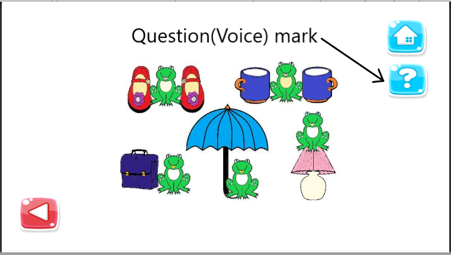

# Kindergarten
Kindergarten app is for 5 or 6 years old children. Its aim is to help children preparing for the first grade.

## Introduction - The project's aim
It would not be wrong to say that mobile games are an important tool of entertainment and having a good time for people of all ages. As a result of increasing interest in mobile games, the idea that mobile games can be used to transfer teaching objectives emerged.

The mobile application which is developed within the scope of the project, is aimed to help first-grade primary school students. In this way, these students can reinforce the subjects which are instructed in the semester. The games which will be included under the name of the project will be developed in accordance with the first-grade mathematics curriculum.

## Table of contents
* [General info](#general-info)
* [Curriculum](#curriculum)
* [How to play](#how-to-play)

## General info

Kindergarten game app is

## Curriculum

The Game consists of two parts.

* Unit-1
 
  1.1 Spatial Relations

  1.1.1 Express spatial (state, place, direction) relationships.

      a) Studies are carried out for the use of expressions indicating location and direction in daily life situations.

      b) While expressing the relations, attention is paid to determine the reference point.

      c) Besides daily life examples, studies can be done on models.

  1.1.2 gives examples of identical objects.

      a) The concept of accompaniment is distinguished by using different models, especially suitable materials in the classroom environment.

  1.2 Weighing

     1.2.1 Compares and sorts objects in terms of mass.

      a) Compares objects in terms of their weights.

      b) First two objects are compared. By using words such as heavier, lighter, the results of the comparison are expressed.

---

* Unit-2 (Not available for now)

  2.1. Natural numbers

   2.1.1 Reads and writes numbers.

       a) The difference between the number and the number is highlighted.
 
      b) Attention is paid to the direction of the figures.
 
     2.1.2 Identifies and writes the number of objects in a community with up to 20 objects (including 20).

      a) It is noticed that while the counting works are being carried out, the last said number expresses the amount of object.
 
      b) It is provided to determine the multiplicity corresponding to a number up to 20.
 
  2.2. Timing

    2.2.1 Reads full and half hours.

      a) Analog and Digital clocks are used.
 
      b) Creates a clock model and reads the hourly heads.

## How to play
First-grade students do not read and write when they are start school if they haven't learned it before.And then we decided the best way is voice guidance. Before starting the game, voice guidance tells the user what to do in the game.

There is one app we can use for text-to-speech: https://apps.apple.com/us/app/text-to-speech/id712104788
